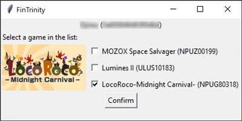
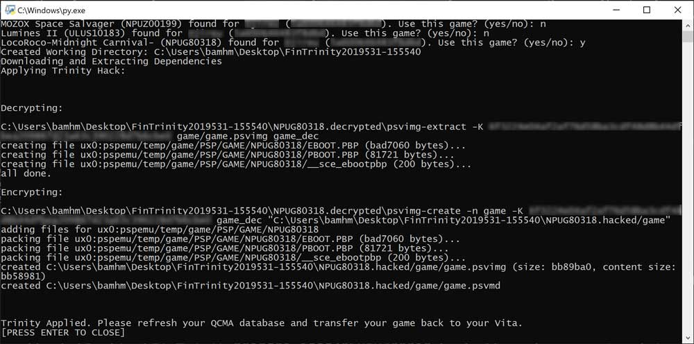

# FinTrinity

This is a GUI/CLI Python script that allows you to use the Trinity Playstation Vita hack by TheOfficialFloW without
much effort.

**This is still very much a work in progress**

FinTrinity aims to make a backup of your game on your Desktop, but it never hurts for you to make an additional,
manual, backup!

# Status

## Windows/Linux
* Standalone and Python Version Fully Working
* Test with Windows 10 (64-bit) and Ubuntu 18.04 (64-bit)

## macOS
* Python version possibly working. Waiting for someone to test it.
* Standalone version probably isn't coming because I don't have a way to build it.

# Usage

## Standalone Version

1) Download the [latest release](https://github.com/bamhm182/FinTrinity/releases) ending in -Linux if you are on Linux,
or -Windows if you are on Windows.
2) Double click the FinTrinity executable and click the "Patch" button.

## Python 3.7.3 Version

1) Install [python 3.7.3](https://www.python.org/downloads/)  
2) [Download the zip](https://github.com/bamhm182/FinTrinity/archive/master.zip) of this repository and double click on
either FinTrinity.py or GUI.py  
3) Confirm the game is correct and it should take care of the rest

# Screenshots

# TODO
* Prettier GUI
* Ability to select from a list of games in the GUI
* macOS support (If you know where the QCMA config is, please let me know!)

# Special Thanks

[TheOfficialFloW](https://github.com/theofficialflow): Created Trinity
(Also, all around awesome leader in the Vita community)  
[/u/lilracerboi](https://www.reddit.com/user/lilracerboi): Recommended PyInstaller 
(Allows you to use FinTrinity w/o Python)  
[Piotr Pabich](https://github.com/hindo): Not only told me where macOS settings were, but also how to read them. Huge
shout out to him for making macOS support possible.