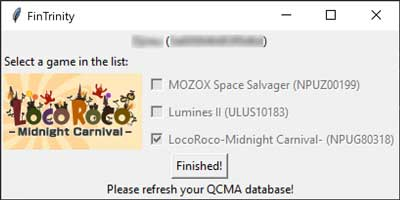

# FinTrinity

This is a GUI that allows you to use the Trinity Playstation Vita hack by TheOfficialFloW without much effort.

**This is still very much a work in progress**

If you do use this, PLEASE make a backup of your game folder first.

This is currently only for Windows. I have tested it with Windows 10 and the latest version of QCMA (v0.4.1)

To use it, you will need to have [python 3.7.3](https://www.python.org/downloads/) installed and in your path. If you
download it and run through the installer, you should be good to go. Once you have that installed, 
[download the zip](https://github.com/bamhm182/FinTrinity/archive/master.zip) of this repository and double click on
either FinTrinity.py or GUI.py

# Screenshots

# TODO
* Prettier GUI
* Ability to select from a list of games in the GUI
* macOS and Linux support
